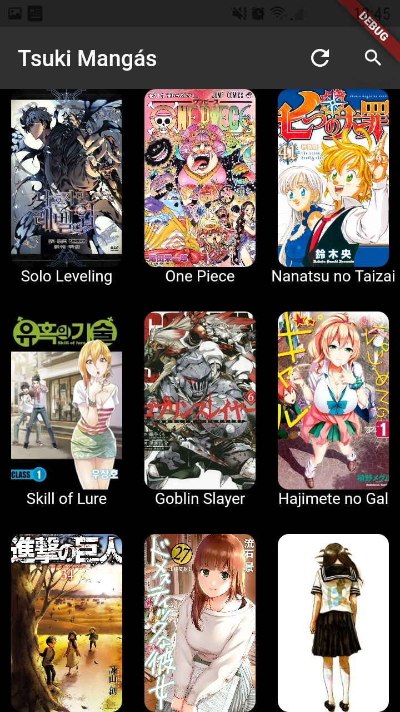
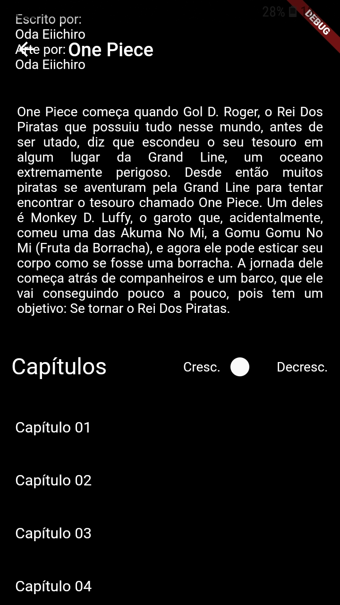
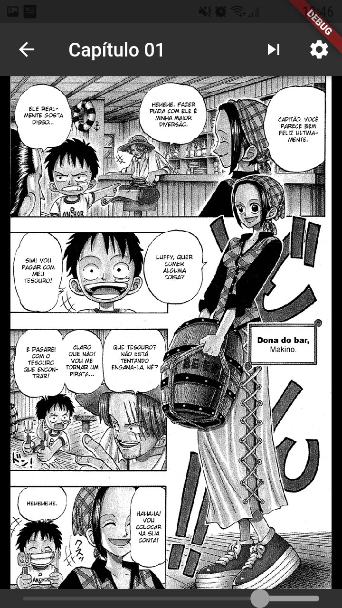

# Leitor de Mangás para o Site Tsuki Mangás

Um simples leitor de mangás em estágio inicial, feito para afiar minhas habilidades com Flutter.

# Fucionalidades:

- Pesquisar por alguma obra específica;
- Ler informações básicas sobre o mangá;
- Explorar seus capítulos;
- Ler o mangá em questão;

# Imagens

 
Página Inicial (com barra de pesquisa)  
 
Página do mangá  
 
Explorador de capítulos  
 
Leitor  

# Desenvolvimento Cessado

Após descobrir que a Tsuki Mangás tem o seu próprio leitor de mangás sendo desenvolvido por uma equipe interna, resolvi interromper o desenvolvimento, visto que o app deles está bem mais avançado, além de que tudo que eu queria aprender e praticar com o desenvolvimento do app já foi aprendido.